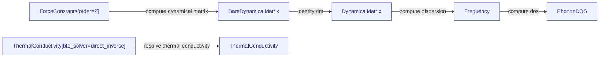

# openmaterials-ai

A typed substrate for computational materials science. Workflows are directed
acyclic graphs of typed physics *spaces* connected by *operators* that carry
symbolic (sympy) formulas. Each external code (kaldo, phono3py, phonopy,
ShengBTE, LAMMPS, GPUMD) is a *representation*: a per-code mapping of its
numerical output onto the shared operator layer. Because every quantity is typed
and every edge carries its formula, the framework reconciles results across codes
mechanically, runs calculations itself, and validates them. This is the best
semantics for AI: the semantic layer (omai/semantics.py, docs/data/semantics.json)
resolves the fuzzy language of papers and LLMs ("quasi-harmonic-approximation",
"phonon-thermal-conductivity") to typed, gated, content-addressed identities,
so an agent that grounds its phrase through resolve() inherits the formula, the
dimensional proof, the producing codes with citations, and the evidence with
provenance. Fuzzy language in, checkable identity out.

Browse the map as an interactive [3D view](https://openmaterials.ai/map/). The
map spans ten physics domains (thermal transport, DFT ground state, mechanics,
stability, thermochemistry, quasi-harmonic, molecular, electronic transport,
materials, and the thermodynamic identities that close its formulas together),
holding 105 typed quantities and 104 operators mapped across 29 codes. The
project's single source of truth (vision, product, architecture, kernel, status,
and the ingest/extend/encode procedures) is
[docs/openmaterials.pdf](docs/openmaterials.pdf) (LaTeX source alongside it).

The database is just files in this repo: the versioned map lives in `map/`
(log-first, content-addressed); the site reads `docs/data/graph.json`
(variables + formulas), `docs/data/catalog.json` (per-node grounding: symbol,
dimension, description), `docs/data/codes.json` (per-code variable coverage),
`docs/data/instances/` (one file per value), and `docs/data/configurations/`
(one file per atomic structure: the content-addressed home of a `Structure`
value, bundled to `docs/data/configurations.json`). Rebuild the generated files
with:

```bash
CUDA_VISIBLE_DEVICES="" PYTHONPATH=. python -m omai.map_data
```

To append a value, add a JSON file under `docs/data/instances/` and open a pull
request. What you contribute stays yours: appending grants the map a
non-exclusive CC BY 4.0 license, never a transfer, and the raw simulation or
experimental artifacts behind a value are never ingested (GOVERNANCE.md, "Data
ownership and fairness").

## Share an experiment with a link

Every instance carries a provenance reference (`source.ref`), and that ref is
the experiment key: all the values one simulation campaign, measurement, or
parsed paper contributed, grouped. The [experiments
page](https://openmaterials.ai/experiment/) lists every group in the store and
gives each one a permalink:

```
https://openmaterials.ai/experiment/#ref=paper:cnt-2021-barbalinardo
```

The page renders the group's values with conditions and uncertainty, its
verbatim provenance quotes, and the map version it was built from, so the link
you share carries the result and its receipts together. To share your own
experiment, contribute its values as instances under one `source.ref` and send
the URL.

For a card whose quantity [MaterialsCodeGraph](https://materialscodegraph.com/)
can actually run, the page adds one more action: a **Run on MaterialsCodeGraph**
link that deep-links MCG's compute wizard (`#/new/<node id>`) prefilled from the
lineage. It is optional and storage-free: it appears only for genuinely runnable
nodes and is simply absent otherwise, adds no data and touches no record, and
the card is identical without it.

OpenMaterials provides templates and lineages; MaterialsCodeGraph stores
experiments and runs simulations from lineages.

A lineage is also a link on its own, no store, no server. A lineage record is
light and lineage-identified (`omai/lineages.py`): its identity is its lineage,
the X-to-Y path from inputs to a result (a map node when known, else a template
with its hyperparameters and setup values), and heavy artifacts are optional pointers to
[MaterialsCodeGraph](https://materialscodegraph.com/), never embedded. Because
it is light, the whole record gzips into a `#x=` link fragment that opens in the
playground's Lineage tab:

```
https://openmaterials.ai/play/#/play?tab=lineage&x=<gzipped record>
```

Opening the link renders straight into a **full-width, dense, plain datasheet**:
a lineage is a data container, and OpenMaterials (the static site) is the
container's viewer, so the view shows the information the record holds, plainly,
not a dashboard. Opening the Lineage tab without a record lazily loads the
committed `si-kappa-kaldo-direct` lineage into the same datasheet, with plain
links to the other nine committed examples. It
presents what the record is (the kind, simulation or measurement, the output map
node, the material, and the short lineage id), the lineage's every field as plain
labelled key-values and a simple value-and-units table (node, node_uid, material
and its pinned configuration, template, all hyperparameters, conditions, params,
and the execution: code, version, container digest, runner, wall time, seeds),
what it means on the map (the node's plain-language description, units, and map
tier pulled from the catalog, and the lineage's X&rarr;Y path stated plainly as its
inputs and its output, for example "Inputs: Potential, Force constants,
Structure, Temperature. Output: Thermal conductivity."), its provenance (the
source ref, and for a parsed paper the paper info), and where the data lives (the
artifact pointers and the mirror host as plain links out, since the heavy bytes
live on MaterialsCodeGraph or Zenodo and the container only points). It ends with
a plain **Run this lineage as a simulation on MaterialsCodeGraph** link when the
node is one MCG can compute (simply absent otherwise) and a Copy link that re-mints
the same `#x=` share URL, so the view is shareable and replayable. **Dashboards and compute live
on MaterialsCodeGraph, not here**: the rich visualization and the running or
replaying are MCG's job; this view is the faithful, plain record. Use **paste
another** in the datasheet, or return to the Lineage tools, to paste a record JSON
or drop a `.json` file (a record MCG serves pastes straight in) and open a
datasheet of your own; the paste/drop ingress validates the record
client-side against the same light shape checks as `validate_light` (lineage
present, artifact pointers well-formed) and is honest about gaps (a
node-unresolved or measurement record still shows its data plainly, without a
fabricated lineage and without a Run link, and says so). It is a view only,
nothing is uploaded or stored, and every reference file it reads (graph, catalog)
is static. The fragment uses the same gzip+base64url scheme as the map-view share
below, so a link a tool produces (`record_to_fragment`) and one the playground
produces interoperate. It is the light path: a record with many artifact pointers
may exceed a practical URL, and that is fine.

The [cross-code agreement page](https://openmaterials.ai/agreement/) takes the
other cut through the same instances: instead of grouping by source, it groups
by the physical question. It finds every set of values that are the same
observable, the same material, and the same physical conditions, differing only
in the method or the code that produced them, and reports their spread:

```
https://openmaterials.ai/agreement/
```

Because only values that answer the identical physical question are ever placed
side by side (same base quantity, material, and every physical condition, differing
solely in estimator), a spread there is a real method or code disagreement, never
an apples-to-oranges artifact. The strongest comparisons are cross-code (the same
method run by two codes on the same inputs) and theory-versus-experiment (a
measurement on the same node as a simulation), both badged.

Views are links too: the map takes `#node=<id>` (and writes it as you click)
and `#experiment=<source.ref>` to light up exactly the quantities an
experiment's evidence covers,
the tracer takes `#node=<id>` or `#from=<id>&to=<id>` for a derivation path,
the playground serializes its whole state behind its Share button and takes
`#x=<gzipped record>` to open a single light lineage record as a plain data
view (what the container holds: every lineage field, a value-and-units table, what
the output node means on the map, where the data lives, and a plain link to run
it as a simulation on MaterialsCodeGraph), and the experiments index takes
`#material=<name>`. Every page has a copy-link control.

## A slice of the map, as Mermaid

Any sub-map exports as a Mermaid flowchart (`python -m omai.mermaid <node>`),
so a lineage renders natively in GitHub markdown, issues, and PRs:



The playground's Map tab has a Copy as Mermaid button for any view you build.

## Install

```bash
pip install -e ".[dev]"   # Python 3.11+
```

## Try it

A self-contained tour that needs no external codes:

```bash
python examples/quickstart.py
```

It builds the operator DAG, derives molar heat capacity from a phonon
frequency array, and cross-checks two inputs at a gauge-invariant observable.

## Parse a paper

The paper parser turns a PDF into a gated evidence proposal (detect reported
values with verbatim quotes, map them onto the node catalog, validate against
the kernel, review, then propose):

```bash
python -m omai.paper_parser <pdf>                # writes a proposal; nothing lands
python -m omai.paper_parser <pdf> --apply --yes  # human-confirmed: writes instances
```

It needs its own extras (`pip install -e ".[parser]"`, already included in
`[dev]`) and an `ANTHROPIC_API_KEY` (environment or a repo-root `.env`); the
key is never printed or logged.

## Run the tests

```bash
pytest
```

## Layout

```
map/                 # the versioned protocol artifact: log-first, content-addressed
                     #   (log.jsonl, current/ materialized view, GENESIS hash)
index/               # the source registry: per-code coverage pinned to the map version
omai/
  operator/          # operator layer: Spaces, Operators, sympy formulas,
                     #   gauge discipline, validate_dag, dimensions, identity;
                     #   learned.py: LearnedOperator, ML surrogates as declared,
                     #   non-authoritative shortcuts of exact-edge paths
  representation/    # the bridge: units, normalizations, per-code specs,
                     #   compare, and the execute/compose/cross-check runtime
  thermal_transport/ # ten per-domain packages: each carries an operator/ DAG
                     #   (Spaces + Operators) and a representation/ set of per-code
                     #   adapters. thermal_transport spans kaldo, phono3py, phonopy,
                     #   shengbte, qe, ase, lammps, gpumd
  dft_ground_state/  # QE DFT ground state: structure, energy, forces, stress
  mechanics/         # elastic tensor, Voigt moduli, pressure (lammps, mat-elasticity)
  stability/         # formation and hull energies, magnetism (pymatgen, mp-api)
  thermochemistry/   # reaction energies, CALPHAD Gibbs energies (pycalphad, rxn-network)
  quasiharmonic/     # quasi-harmonic thermal expansion, Gruneisen (phonopy QHA)
  molecular/         # NEB barriers, bond dissociation energies (orca, openmm)
  electronic_transport/ # carrier transport, Nernst-Einstein conductivity (amset)
  materials/         # materials-diffusion subgraph, skills_catalog.json (AtomisticSkills)
  thermodynamic_identities/ # six executable relations closing the map's formulas
                     #   together (Gruneisen, kappa_total, molar volume, C_P-C_V, PF, ZT)
  paper_parser/      # P1 paper parser: PDF -> gated evidence proposal (six stages)
  configurations.py  # structure-valued evidence: content-addressed atomic cells
  map_data.py        # unified multi-domain export -> docs/data/*.json
  store.py           # log-first store: push/read/diff/verify
infra/
  learn-proxy/       # cost-gated Cloudflare Worker relaying the Learn-page parser demo
examples/            # runnable tours; start with quickstart.py
experiments/         # full cross-code material studies (silicon, germanium, NaCl)
tests/               # pytest suite
docs/                # the openmaterials document + the openmaterials.ai site
                     #   (map, map-trace, learn, deck, map-lab)
```

## Structure and stewardship

The project is one map in three parts. The map itself (the versioned graph,
its evidence, and the rules that govern changes) is the commons, stewarded
by OpenMaterials-AI, an open initiative structured as a foundation in
formation: map data is CC BY 4.0 (LICENSE-DATA), the kernel is Apache 2.0
(LICENSE), and GOVERNANCE.md states the boundary rule and the graduation
path. The interfaces (the site, the views, the bibliography tooling) and
the AI improvement engine (the paper parser, the scan agents) are built by
Da Vinci Labs on top of the commons. Cite via CITATION.cff, stating the map
version (docs/data/version.json) your work used.

Evidence stays its owner's. Contributing a value grants the map a
non-exclusive CC BY 4.0 license and transfers nothing; there is no copyright
assignment and no CLA; raw simulation and experimental artifacts are never
ingested and remain under their owners' own terms. Attribution is enforced
in both directions: upstream, every mapped code's citation and license is
recorded in its rail and every parsed paper is quoted verbatim with page
anchors as a merge gate; downstream, reuse must credit the map version and,
through it, the original sources. The full statement is GOVERNANCE.md,
"Data ownership and fairness".

## Design

The architecture is Part III of `docs/openmaterials.pdf`; the implemented kernel
(dimensions, identity, store, genesis) is Part IV. Read the Principles and the
two-worlds section first.
